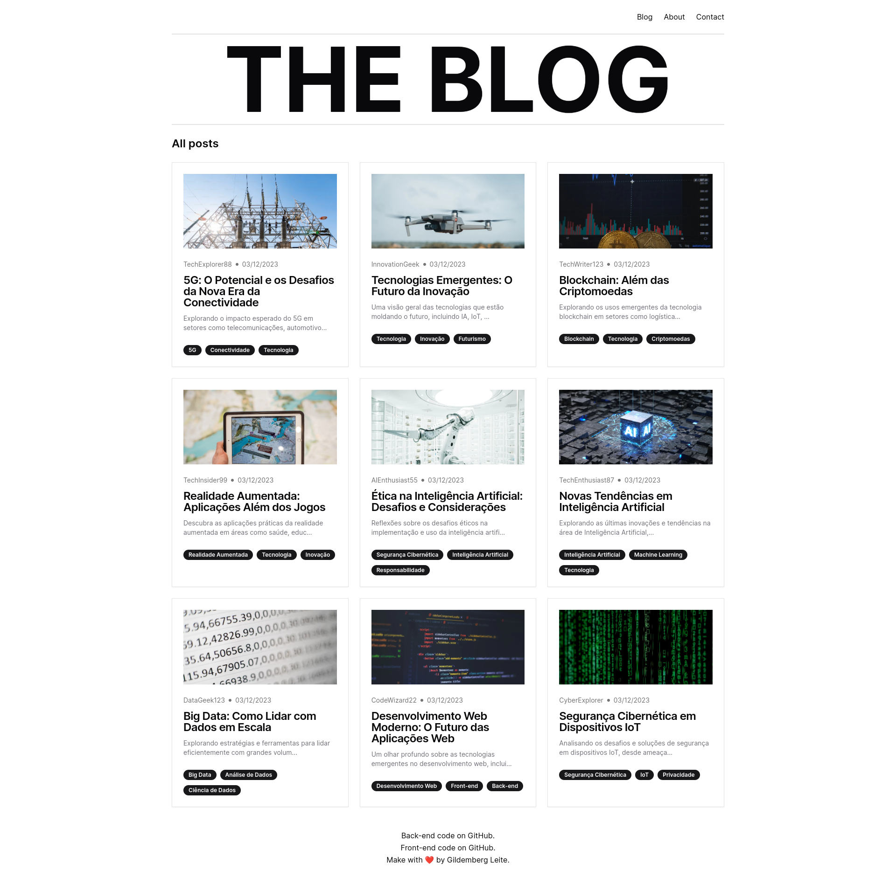

# THE BLOG

[](https://github.com/gildembergleite/blog-frontend-nextjs-tailwind)
[](https://github.com/vercel/next.js/)
[](https://github.com/shadcn-ui/ui)
[](https://github.com/tailwindlabs/tailwindcss)
[](https://github.com/strapi/strapi)
[](https://opensource.org/licenses/MIT)

## Descrição

O THE BLOG é um projeto de blog desenvolvido utilizando NextJS e TailwindCSS para o frontend, e Strapi como o backend para gerenciar o conteúdo. O blog é uma plataforma onde os usuários podem explorar e criar conteúdo, proporcionando uma experiência de leitura agradável e interativa.



## Principais Tecnologias Utilizadas

- NextJS 14
- TypeScript
- TailwindCSS
- shadcn/ui
- Strapi 4.15.5

## Como Clonar o Repositório

Siga os passos abaixo para clonar o projeto:

1. Abra o terminal e navegue até o diretório em que deseja clonar o projeto.

```bash
cd /seu/diretorio/de/escolha
```

2. Clone o repositório usando o seguinte comando:

```bash
git clone https://github.com/gildembergleite/blog-frontend-nextjs-tailwind.git
```

3. Navegue para o diretório do projeto:

```bash
cd blog-frontend-nextjs-tailwind
```

4. Instale as dependências do projeto:

```bash
npm install
# ou
yarn install
```

5. Inicie a aplicação localmente:

```bash
npm run dev
# ou
yarn dev
```

Agora você pode acessar o blog em [http://localhost:3000](http://localhost:3000).

## Configuração do Backend

O link do atual back-end está disponível no arquivo .env, mas caso queira, o código fonte do strapi está disponível aqui:

### https://github.com/gildembergleite/blog-backend-strapi

Siga as instruções fornecidas no repositório do backend para configurar e iniciar o servidor.

## Licença

Este projeto é licenciado sob a [Licença MIT](LICENSE).